# Mapyrus

http://www.mapyrus.org

Mapyrus is software for
creating plots of points, lines, polygons and labels
to PostScript (high resolution, up to A0 paper size),
Portable Document Format (PDF),
Scalable Vector Graphics (SVG) format
and web image output formats.

Mapyrus is open source software and is implemented entirely in Java
enabling it to run on a wide range of operating systems.

The software combines the following three features.

### Logo Or Turtle Graphics

An imaginary pen is moved around a page,
creating shapes that are drawn into an image file.
Reusable routines are built up using a BASIC-like language.
Branching and looping constructs enable complex shapes, symbols, patterns
and graphs to be be defined.

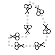
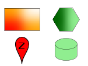
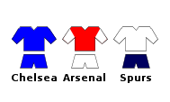

### Data Display

Reading and displaying of geographic information
system (GIS) datasets,
text files, or tables held in a relational database
(including spatially extended databases such as Oracle Spatial,
PostGIS and MySQL).

Drawing routines are applied to geographic data to produce annotated and
symbolized maps and graphs.  Attributes of the geographic data control
the color, size, annotation and other characteristics of the
appearance of the geographic data.
Scalebars, legends, coordinate grids and north arrows are also available.

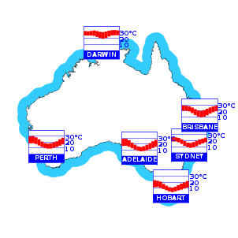

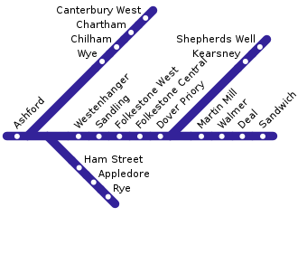

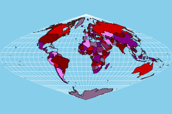

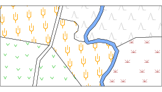
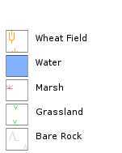

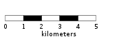
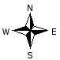

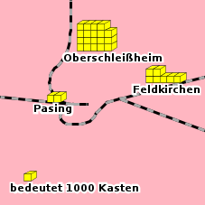

### Geometry Algorithms

Integration with the freely-available
[JTS Topology Suite](http://www.tsusiatsoftware.net/jts/main.html).
This library provides geometric algorithms
such as buffering, point-in-polygon test and polygon intersection.

Integration with the freely-available
[JH Labs](http://www.jhlabs.com/java/maps/proj)
Java port of the [PROJ.4](https://proj.org/) projection library.

# Documentation

Further examples are included in the [tutorial](tutorial.md).

The [reference](reference.md) describes how Mapyrus works in detail.

Changes in each released version are listed in [NEWS](NEWS.md).

Report bugs and request changes or extensions to Mapyrus
as [GitHub Issues](https://github.com/simoc/mapyrus/issues).

Mapyrus is released under the [GNU Lesser General Public License](COPYING).
The software, documentation and source code is available for download
from [SourceForge](https://mapyrus.sourceforge.net/download.html).
